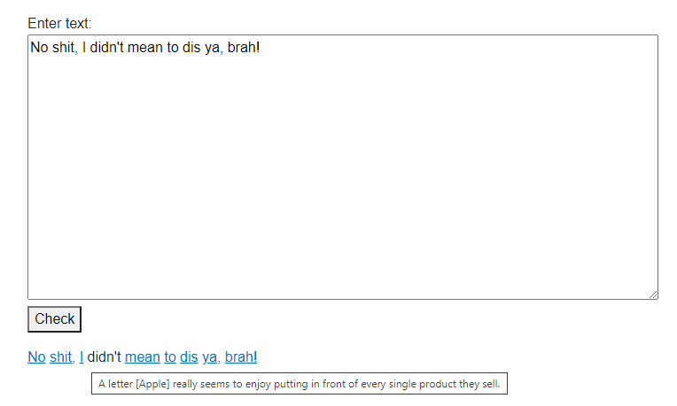

# [Urban Dictionary](https://www.urbandictionary.com/) Spell Checker
Don't accidentally [diss](http://diss.urbanup.com/37489) someone, [brah](http://brah.urbanup.com/1485311)!



An app to check your messages to see if you have inadvertently included any slang.
It might stop someone [popping a cap in your ass.](https://www.urbandictionary.com/define.php?term=pop+a+cap+in+your+ass)

## Prerequisites
* .NET Core 6
* _MongoDB_

## Getting started

### Build solution:

```bash
$ dotnet build
```

### Run API

```bash
$ cd urban-dictionary-spell-checker
$ dotnet run
```

* open [SwaggerUI](http://localhost:5003/swagger/index.html)
* enter text and see what [SNAFU](http://snafu.urbanup.com/449743) you've done!

### Run UI:
Note that API must be running.

```bash
$ cd urban-dictionary-spell-checker-ui
$ dotnet run
```

* open [UI](http://localhost:5287/)
* enter text, click on _Check_ and see what [fax pas](http://faux-pas.urbanup.com/919144) you've made!

## Urban Dictionary Data
There *is* an [Unofficial Urban Dictionary API](https://dev.to/nhighleysalongenius/comment/epgk)

```text
but I wouldn't count on your app surviving for long if they see you slurping traffic.
```

Unless we absolutely need the latest information, an offline snapshot is good enough.

<details>

### Getting data
_Urban Dictionary_ is **huge**, so the dataset is correspondingly large.  As such, it has not been included in this repository.
It can be downloaded from the following links:

* https://www.reddit.com/r/datasets/comments/63spoc/19gb_of_urban_dictionary_definitions_1999_may_2016/
* https://archive.org/details/UrbanDictionary1999-May2016DefinitionsCorpus
  * UT_raw_plus_lowercase.7z (380 MB)
    * `words.json` (1.7 GB)

### Loading data
* extract `words.json` from `UT_raw_plus_lowercase.7z`
* import into _MongoDB_:
  * database: `urban-dictionary`
  * collection: `words`

</details>
